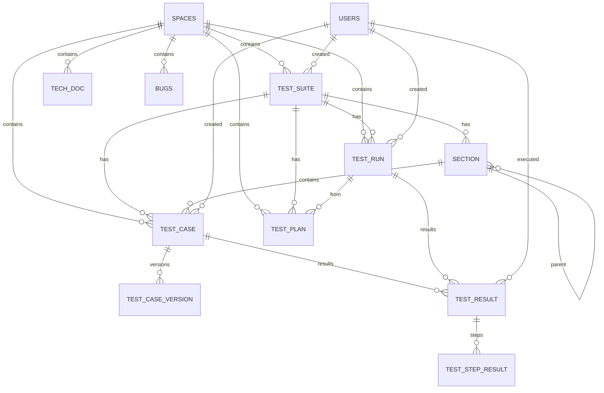

# VTPad Architecture

## Overview

VTPad is a test management platform with a FastAPI backend and Vue 3 frontend. It supports test suites, cases, runs, plans, tech docs, bugs, and analytics.

```
┌─────────────────────────────────────────────────────────────────────────┐
│                              FRONTEND                                   │
│  Vue 3 + Vuetify 3 + Vite + unplugin-vue-router + Pinia               │
│  TipTap editor, Chart.js, vue3-toastify, axios                        │
└─────────────────────────────┬───────────────────────────────────────────┘
                              │ HTTP / WebSocket
┌─────────────────────────────┴───────────────────────────────────────────┐
│                              BACKEND                                    │
│  FastAPI + Tortoise ORM + PostgreSQL 16 + Redis                       │
│  JWT auth + API tokens, pgvector, OpenTelemetry, Prometheus           │
│  MCP Server (FastMCP) mounted at /v1/mcp                              │
└─────────────────────────────────────────────────────────────────────────┘
```

---

## Backend Architecture

### Tech Stack
- **Framework**: FastAPI 0.136+
- **ORM**: Tortoise ORM 0.21+ (async)
- **Database**: PostgreSQL 16 with pgvector extension
- **Cache**: Redis
- **Auth**: JWT (web) + SHA256 API Tokens (MCP)
- **MCP**: FastMCP 3.3+ with SSE transport
- **Observability**: OpenTelemetry + Prometheus

### Project Structure
```
app/src/
├── common/           # Crypto, config, models scanner
├── auth/             # JWT login, refresh
├── users/            # User CRUD
├── spaces/           # Space (project) management
├── company/          # Multi-tenant company admin
├── bug/              # Legacy bug tracker (v1)
├── comments/         # Bug comments
├── tag/              # Tags
├── notification/     # In-app notifications
├── report/           # Legacy reporting
├── qa_report/        # QA report generation

# New v2 test management modules
├── test_suite/       # TestSuite model, CRUD
├── section/          # Section model, tree CRUD
├── test_case/        # TestCase + Version models, CRUD
├── test_run/         # TestRun + TestResult + TestStepResult models
├── test_plan/        # TestPlan model, filter cases, create runs
├── environment/      # Test environments
├── milestone/        # Milestones
├── custom_field/     # Custom fields
├── attachment/       # File attachments
├── tech_doc/         # Tech documentation wiki
├── embedding/        # Semantic search (pgvector)
├── api_token/        # MCP API tokens
├── analytics/        # Dashboard analytics
└── migration/        # JSON-based SQL migrations
```

### Database Schema (Mermaid)



### Key Models

#### TestCaseModel
| Field | Type | Notes |
|-------|------|-------|
| id | UUID | PK |
| title | Text | Required |
| text | Text | Description (HTML from TipTap) |
| steps | Text | Steps (HTML) |
| expected_results | Text | Expected results (HTML) |
| preconditions | Text | Preconditions (HTML) |
| postconditions | Text | Postconditions (HTML) |
| type | Enum | manual, checklist, automated |
| status | Enum | draft, active, deprecated |
| sort | Int | Ordering within section |
| space | FK | → SpaceModel |
| suite | FK | → TestSuiteModel (nullable) |
| section | FK | → SectionModel (nullable) |

#### TestRunModel
| Field | Type | Notes |
|-------|------|-------|
| id | UUID | PK |
| name | Text | Required |
| status | Enum | draft, active, completed |
| space | FK | → SpaceModel |
| suite | FK | → TestSuiteModel (nullable) |
| plan | FK | → TestPlanModel (nullable) |
| milestone | FK | → MilestoneModel |
| environment | FK | → EnvironmentModel |
| started_at | DateTime | |
| completed_at | DateTime | |

#### TestResultModel
| Field | Type | Notes |
|-------|------|-------|
| id | UUID | PK |
| status | Enum | not_run, passed, failed, blocked, skipped |
| duration_seconds | Int | |
| comment | Text | |
| linked_bug_ids | JSON | Array of bug short names |
| run | FK | → TestRunModel |
| testcase | FK | → TestCaseModel |
| testcase_version | FK | → TestCaseVersionModel |
| executed_by | FK | → UserModel |
| executed_at | DateTime | |

#### TestStepResultModel
| Field | Type | Notes |
|-------|------|-------|
| id | UUID | PK |
| step_index | Int | Position in steps list |
| step_text | Text | Copied from case steps |
| status | Enum | not_run, passed, failed, blocked, skipped |
| comment | Text | |
| screenshot_url | Text | |
| result | FK | → TestResultModel |

#### TestPlanModel
| Field | Type | Notes |
|-------|------|-------|
| id | UUID | PK |
| name | Text | Required |
| description | Text | |
| filters | JSONB | {types, sections, statuses, tags} |
| space | FK | → SpaceModel |
| suite | FK | → TestSuiteModel (nullable) |

### API Structure

All v2 endpoints are prefixed with `/api/v2/`.

| Module | Base Path |
|--------|-----------|
| Test Suite | `/api/v2/test-suite` |
| Section | `/api/v2/section` |
| Test Case | `/api/v2/test-case` |
| Test Run | `/api/v2/test-run` |
| Test Plan | `/api/v2/test-plan` |
| Analytics | `/api/v2/analytics` |
| Tech Doc | `/api/v2/tech-doc` |
| Environment | `/api/v2/environment` |
| Milestone | `/api/v2/milestone` |
| Attachment | `/api/v2/attachment` |
| API Token | `/api/v2/api-token` |

### Auth

Two authentication systems:
1. **JWT** (web frontend) — stored in localStorage, used for all `/api/v2/*` calls
2. **API Token** (MCP) — SHA256 hashed tokens, used for `/v1/mcp/*`

`get_user_id_by_token()` tries API token first, then JWT fallback.

### Semantic Search

- Embeddings generated via Ollama `nomic-embed-text:latest` (768 dimensions)
- Stored in `embedding` table with `embedding_vector vector(768)` column
- HNSW index for fast approximate search
- Fallback to Python cosine similarity on JSONB if pgvector fails

---

## Frontend Architecture

### Tech Stack
- **Framework**: Vue 3.4 + Composition API / Options API mix
- **UI Library**: Vuetify 3
- **Build Tool**: Vite 5.1
- **Routing**: unplugin-vue-router (file-based) + vite-plugin-vue-layouts
- **State**: Pinia (1 minimal store)
- **HTTP**: Axios (global config in App.vue)
- **Editor**: TipTap v2
- **Charts**: Chart.js / vue-chartjs
- **Toasts**: vue3-toastify

### Project Structure
```
src/
├── pages/              # File-based routing
│   ├── index.vue
│   ├── auth/
│   ├── company/
│   ├── profile/
│   └── space/:spaceId/
│       ├── index.vue
│       ├── dashboard/
│       ├── test-suites/
│       ├── test-cases/
│       ├── test-runs/
│       ├── test-plans/
│       ├── tech-docs/
│       ├── bugs/
│       ├── report/
│       └── settings/
├── components/
│   ├── common/         # Reusable: editor, breadcrumbs, command palette
│   ├── test-suites/
│   ├── test-cases/
│   ├── test-runs/
│   ├── test-plans/
│   ├── tech-docs/
│   ├── bugs/
│   ├── reports/
│   └── leftAsideMain/
├── layouts/            # Page layouts
│   ├── default.vue
│   ├── spaces.vue
│   ├── spacesReport.vue
│   └── spacesSettings.vue
├── stores/
│   └── app.js          # Minimal Pinia store
└── plugins/
    └── vuetify.js
```

### Routing

Dynamic routes use bracket notation or colon prefix:
- `space/:spaceId/test-suites/:suiteId.vue` → `/space/123/test-suites/456`
- `space/:spaceId/test-cases/[caseId]/edit.vue` → `/space/123/test-cases/456/edit`

Layout is assigned via `<route>` block:
```vue
<route>
{
  meta: {
    layout: "spaces",
    tabValue: "test-suites"
  }
}
</route>
```

### API Client Pattern

Axios is configured globally in `App.vue`:
- Base URL from `VITE_API_BASE_URL`
- Request interceptor injects `Authorization: Bearer <jwt>`
- Response interceptor shows toast on errors, handles 401 refresh

Components use axios directly:
```js
import axios from "axios";
axios.get(`/api/v2/test-case/space/${this.spaceId}`, { params: {...} })
```

### State Management

Single Pinia store (`stores/app.js`) holds:
- `openBug`, `openSpaceId`, `shortName`
- `getSpaceId()` — resolves short name → UUID

All list/filter/pagination state lives locally in components.

---

## MCP Server

FastMCP server mounted at `/v1/mcp` with SSE transport.

### Authentication
- `MCPAuthMiddleware` validates `Authorization: Bearer <API_TOKEN>`
- Tokens managed via `ApiTokenService` (SHA256 hash)

### Tools (33 total)

| Category | Tools |
|----------|-------|
| **Discovery** | `get_spaces` |
| **Test Cases** | `get_case`, `search_cases`, `create_test_case`, `update_test_case`, `delete_test_case`, `hard_delete_test_case`, `find_similar_cases` |
| **Suites** | `get_suite`, `create_suite`, `update_suite`, `delete_suite`, `hard_delete_suite` |
| **Sections** | `create_section`, `update_section`, `delete_section`, `hard_delete_section` |
| **Tech Docs** | `get_doc`, `search_tech_docs`, `create_tech_doc`, `update_tech_doc`, `delete_tech_doc` |
| **Runs** | `create_test_run`, `get_run_results`, `update_test_result`, `link_bug_to_result` |
| **Analytics** | `get_analytics`, `get_case_history` |
| **Semantic Search** | `semantic_search_tech_docs`, `semantic_search_cases` |

---

## Deployment

### Docker
```bash
docker-compose up --build
```

### Environment Variables
```
DB_NAME, DB_USER, DB_PASSWORD, DB_HOST, DB_PORT
BACKEND_PORT
REDIS_HOST, REDIS_PORT
SECRET_KEY
OLLAMA_HOST
```

### Migrations
JSON-based in `app/src/migration/data/`. Run via:
```bash
python -c "from app.migration import init, migration; import asyncio; asyncio.run(init()); asyncio.run(migration.run_migration())"
```

---

## Development

### Backend
```bash
cd vtpad_backend
source .venv/bin/activate
uvicorn app.main:app --reload --port 8000
```

### Frontend
```bash
cd vtpad_front_v2
npm install
npm run dev
```

### Adding New Pages
1. Create `.vue` file under `src/pages/`
2. Add `<route>` block with layout and tabValue
3. Restart dev server (`npm run dev`) — unplugin-vue-router requires restart
