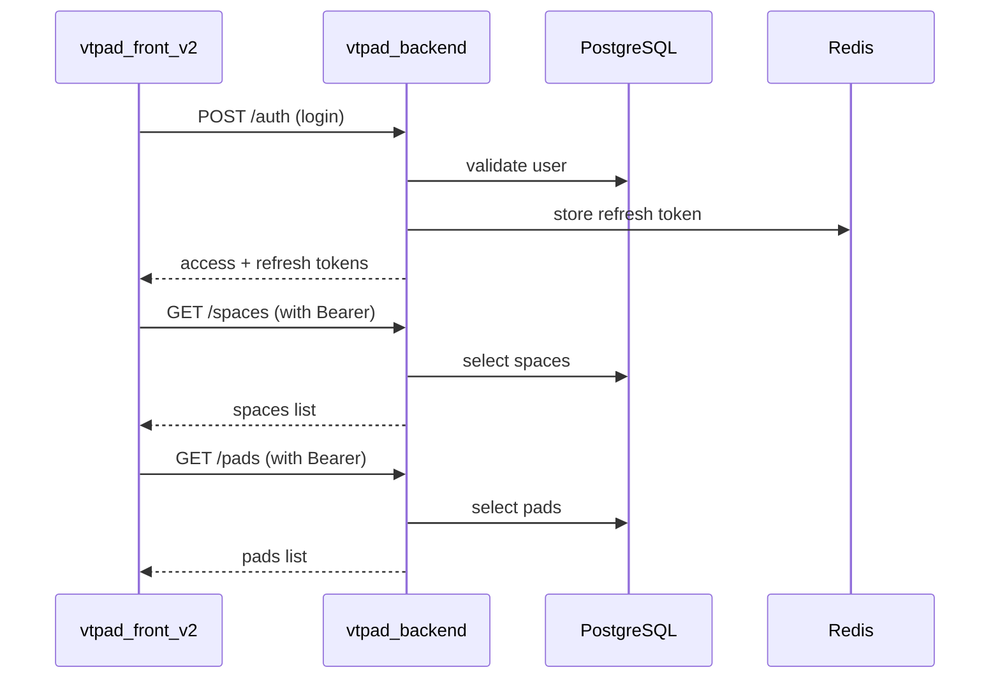

# Codebase Map

## Что описывает

Карта кодовой базы по частям проекта: назначение, точки входа, ключевые зависимости и куда смотреть при инцидентах.

## Preconditions

- Рассматривается текущее состояние монорепозитория `vtpad`.
- Карта отражает код и доступные конфигурации в директориях backend и frontend.

## Сервисная карта

| Часть | Стек | Точка входа | Назначение | Ключевые зависимости |
|---|---|---|---|---|
| `vtpad_backend` | Python 3.10 + FastAPI | `app/main.py` | REST API, бизнес-логика, авторизация, CRUD доменных сущностей | PostgreSQL, Redis, Tortoise ORM, Pydantic v2 |
| `vtpad_front_v2` | Vue 3 + Vuetify 3 + Vite | `src/main.js` | SPA: управление spaces, pads, runs, bugs, testcases, checklists | Axios, Pinia, vue-router, TipTap, Chart.js |

## Критические интеграционные потоки

1. `Auth flow`
   - `vtpad_front_v2` -> `vtpad_backend` (`POST /auth`, `POST /auth/refresh`).
   - Access token — JWT; refresh token — в Redis.
2. `Pad / Run lifecycle`
   - frontend -> backend: CRUD pad -> CRUD run -> CRUD runitems.
3. `Bug tracking`
   - frontend -> backend: CRUD bug -> comments -> tags.

## Sequence (высокоуровневый runtime path)

## Где искать при инциденте

| Симптом | Первичный сервис для проверки | Куда смотреть в коде |
|---|---|---|
| Не проходит вход | `vtpad_backend` | `app/src/auth/router.py`, `app/src/auth/service.py`, `app/src/common/crypto.py` |
| Не загружаются spaces | `vtpad_backend` | `app/src/space/router.py`, `app/src/space/service.py` |
| Не создаётся pad / run | `vtpad_backend` | `app/src/pad/router.py`, `app/src/run/router.py`, Tortoise model relations |
| Ошибки 500 на багах | `vtpad_backend` | `app/src/bug/router.py`, `app/src/bug/service.py` (много raw SQL) |
| Не открывается UI | `vtpad_front_v2` | `src/router/index.js`, browser console, `VITE_API_BASE_URL` |

## Ограничения

- В `vtpad_backend` много raw SQL в сервисах; при рефакторинге моделей ломаются запросы.
- В `vtpad_front_v2` нет выделенного API-клиента; Axios вызывается прямо в компонентах/сторах.

## UI базовый стандарт (таблицы)

- Для новых списков используем визуальный паттерн `test-suites`: `v-toolbar` + `v-data-table-server` без дополнительных глобальных оберток.
- Кастомные table-обертки добавлять только при явной UX-задаче, чтобы сохранить единый вид страниц.
- Для index-страниц space-разделов используем единый контейнер: `v-container.mx-auto.custom-container.max-width-1500`.
- Для `tech-docs` используется тот же контейнер ширины; внутри отдельный split-layout (sidebar/content) с поиском по дереву и breadcrumbs текущей страницы.
- Для `tech-docs` sidebar-tree при открытии без `doc` в query сбрасывает внутренний скролл к началу списка.
- Для `tech-docs` sidebar-дерево рендерится как управляемый `v-list` (иерархия с отступами), чтобы список гарантированно начинался сразу под поиском без layout-сдвигов `v-treeview`.
- Для `tech-docs` просмотр контента выполняется через `editor-component` в режиме `readonly` (единый рендер с edit-режимом, без отдельного HTML/prose-рендера).
- TipTap preset (`ProseMirror`) вынесен в общий `src/components/common/editor/editorComponent.vue` и используется на всех страницах редактора: типографика заголовков/списков, стили code/pre/table/blockquote/task-list, ограничение ширины чтения.
- Композиция редактора: `editorComponent.vue` (контейнер + extensions), `editorMenuComponent.vue` (группированная тулбар-панель с tooltips, диалогом ссылки, загрузкой изображений, управлением таблицами), `editorSlashExtension.js` + `editorSlashMenu.vue` (slash-команды `/` для вставки блоков).
- В `editorMenuComponent.vue` для `code block` доступен выбор языка (language attr), чтобы корректно сохранять fenced code blocks в Markdown с языком подсветки.
- `editorComponent.vue` в режиме `contentFormat=markdown` автоматически нормализует legacy HTML-вход в Markdown уже при инициализации, чтобы при сохранении без ручных правок контент не возвращался в HTML.
- `ProseMirror` привязан к глобальным токенам типографики (`--vt-font-size-body-1`, `--vt-line-height-base`, `--vt-font-size-h*`), чтобы rich-text блоки не выбивались по размеру относительно остального UI.
- Правило консистентности: визуальные изменения редактора (border/shadow/typography/spacing) вносятся только в `src/components/common/editor/editorComponent.vue`, без page-specific override в отдельных страницах.
- Базовая типографика всего приложения централизована в `src/styles/typography.scss` (подключается в `src/main.js`): единая шкала размеров для заголовков/body/caption и ключевых Vuetify-элементов (`v-btn`, `v-field`, `v-list`, `v-table`).
- Локальные `font-size` в страницах/фичах должны заменяться на глобальные utility-классы (`text-h*`, `text-body-*`, `text-caption`) или inherited-типографику без ручных числовых значений.
- Типографика применена в “мягком” режиме: utility-классы и базовый body-scale управляются глобально, а внутренние размеры `v-card-text`/`v-list-item-*`/`v-field` не форсируются фиксированными значениями.
- Глобальный `focus-visible` применяется ко всем интерактивным элементам, кроме `input`/`textarea`/`select` (вводимые поля используют штатный стиль фокуса Vuetify без дополнительной внешней outline-обводки).
- Дополнительно глобально нормализованы Vuetify-заголовки/навигация: `v-card-title`, `v-toolbar-title`, `v-tab`, `v-list-item-title`, `v-list-item-subtitle`.
- Калибровка: `v-card-title` приведён к более компактному уровню (`h6` scale), а заголовки `ProseMirror` снижены на один шаг относительно базовой heading-шкалы для визуального баланса с UI-карточками.
- Для повторяемой UI-регрессии фронта добавлен сценарный smoke-скрипт `vtpad_front_v2/scripts/ui-regression.mjs` (login + ключевые разделы + detail-переходы + sanity-check типографики + отчёт/скриншоты в `playwright-ui-regression/`).
- Полный регрессионный набор (smoke/full/negative/permissions/responsive) описан в `project-docs/docs/ops/ui-regression-full-checklist.md`.

## Источники в коде

- `vtpad_backend/app/main.py`
- `vtpad_backend/app/src/auth/router.py`
- `vtpad_backend/app/src/space/router.py`
- `vtpad_backend/app/src/pad/router.py`
- `vtpad_backend/app/src/run/router.py`
- `vtpad_backend/app/src/bug/router.py`
- `vtpad_front_v2/src/main.js`
- `vtpad_front_v2/src/router/index.js`
- `vtpad_front_v2/src/stores/app.js`
- `vtpad_front_v2/src/components/common/editor/editorComponent.vue`
- `vtpad_front_v2/src/components/common/editor/editorMenuComponent.vue`
- `vtpad_front_v2/src/components/common/editor/editorSlashExtension.js`
- `vtpad_front_v2/src/components/common/editor/editorSlashMenu.vue`
