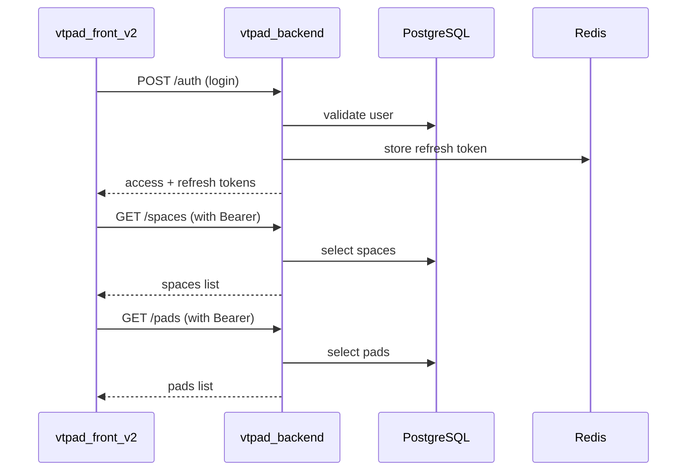

# Codebase Map

## Что описывает

Карта кодовой базы по частям проекта: назначение, точки входа, ключевые зависимости и куда смотреть при инцидентах.

## Preconditions

- Рассматривается текущее состояние монорепозитория `vtpad`.
- Карта отражает код и доступные конфигурации в директориях backend и frontend.

## Сервисная карта

| Часть | Стек | Точка входа | Назначение | Ключевые зависимости |
|---|---|---|---|---|
| `vtpad_backend` | Python 3.10 + FastAPI | `app/main.py` | REST API, бизнес-логика, авторизация, CRUD доменных сущностей | PostgreSQL, Redis, Tortoise ORM, Pydantic v2 |
| `vtpad_front_v2` | Vue 3 + Vuetify 3 + Vite | `src/main.js` | SPA: управление spaces, pads, runs, bugs, testcases, checklists | Axios, Pinia, vue-router, TipTap, Chart.js |

## Критические интеграционные потоки

1. `Auth flow`
   - `vtpad_front_v2` -> `vtpad_backend` (`POST /auth`, `POST /auth/refresh`).
   - Access token — JWT; refresh token — в Redis.
2. `Pad / Run lifecycle`
   - frontend -> backend: CRUD pad -> CRUD run -> CRUD runitems.
3. `Bug tracking`
   - frontend -> backend: CRUD bug -> comments -> tags.

## Sequence (высокоуровневый runtime path)

## Где искать при инциденте

| Симптом | Первичный сервис для проверки | Куда смотреть в коде |
|---|---|---|
| Не проходит вход | `vtpad_backend` | `app/src/auth/router.py`, `app/src/auth/service.py`, `app/src/common/crypto.py` |
| Не загружаются spaces | `vtpad_backend` | `app/src/space/router.py`, `app/src/space/service.py` |
| Не создаётся pad / run | `vtpad_backend` | `app/src/pad/router.py`, `app/src/run/router.py`, Tortoise model relations |
| Ошибки 500 на багах | `vtpad_backend` | `app/src/bug/router.py`, `app/src/bug/service.py` (много raw SQL) |
| Не открывается UI | `vtpad_front_v2` | `src/router/index.js`, browser console, `VITE_API_BASE_URL` |

## Ограничения

- В `vtpad_backend` много raw SQL в сервисах; при рефакторинге моделей ломаются запросы.
- В `vtpad_front_v2` нет выделенного API-клиента; Axios вызывается прямо в компонентах/сторах.

## Источники в коде

- `vtpad_backend/app/main.py`
- `vtpad_backend/app/src/auth/router.py`
- `vtpad_backend/app/src/space/router.py`
- `vtpad_backend/app/src/pad/router.py`
- `vtpad_backend/app/src/run/router.py`
- `vtpad_backend/app/src/bug/router.py`
- `vtpad_front_v2/src/main.js`
- `vtpad_front_v2/src/router/index.js`
- `vtpad_front_v2/src/stores/app.js`
