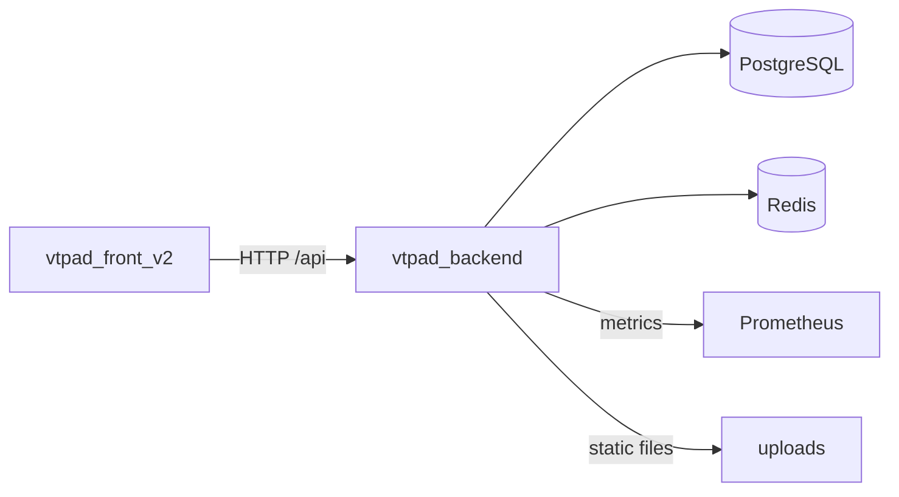

# Обзор системы

## Что описывает

Страница фиксирует роли частей приложения и baseline-схему связей между backend, frontend и внешними зависимостями в экосистеме VTPad.

## Preconditions

- Репозиторий доступен локально как монорепа.
- Описание основано на текущем коде и README.

## Состав частей

- `vtpad_backend`: основной API (FastAPI), бизнес-логика, авторизация, CRUD всех доменных сущностей.
- `vtpad_front_v2`: SPA (Vue 3 + Vuetify 3), UI для управления тестами, багами, прогонами.
- `PostgreSQL`: основная БД для всех доменных сущностей.
- `Redis`: кеш, хранилище refresh-токенов, rate-limit (при необходимости).
- `Prometheus`: метрики backend'а (через `prometheus-fastapi-instrumentator`).

## Системная схема

## Runtime и deployment view (baseline)

### Docker Compose pattern

| Сервис | Тип развертывания | Порты / endpoints | Особенности |
| --- | --- | --- | --- |
| `vtpad_backend` | `uvicorn` inside Docker | `:8000` | `docker-compose.yml` и `docker-compose.dev.yml`; CORS `allow_origins=['*']` |
| `vtpad_front_v2` | `serve` (static) inside Docker | `:3000` | Dockerfile: build -> `serve -s dist` |
| `vtpad_backend` + `vtpad_front_v2` | app-only Docker Compose | `:8000`, `:3000` | `docker-compose.app-only.yml`; только приложения, без PostgreSQL и Redis; traefik labels берут `DOMAIN_EXT` из корневого `.env` |
| `PostgreSQL` | Docker service (compose) | `:5432` | Версия 14 (prod) / 13.3 (dev) |
| `Redis` | Docker service (compose) | `:6379` | Версия 6 |

### Критические точки отказа

1. `PostgreSQL`:
   - Единственная точка хранения доменных данных; недоступность блокирует все операции.
2. `Redis`:
   - Хранит refresh-токены; при недоступности пользователи не смогут обновить access token.
3. `vtpad_backend`:
   - Единый API-шлюз; деградация останавливает всю бизнес-логику.

## Ограничения и примечания

- CORS настроен крайне permissive (`allow_origins=['*']`).
- Нет rate-limiting middleware.
- Файлы загружаются в локальную директорию `./uploads` и раздаются как static.
- Schema generation отключена (`generate_schemas=False`); миграции управляются внешне.

## Источники в коде

- `vtpad_backend/app/main.py`
- `vtpad_backend/docker-compose.yml`
- `vtpad_backend/docker-compose.dev.yml`
- `vtpad_front_v2/Dockerfile`
- `vtpad_front_v2/docker-compose.yml`
- `docker-compose.app-only.yml`
- `vtpad_backend/app/src/common/config.py`
