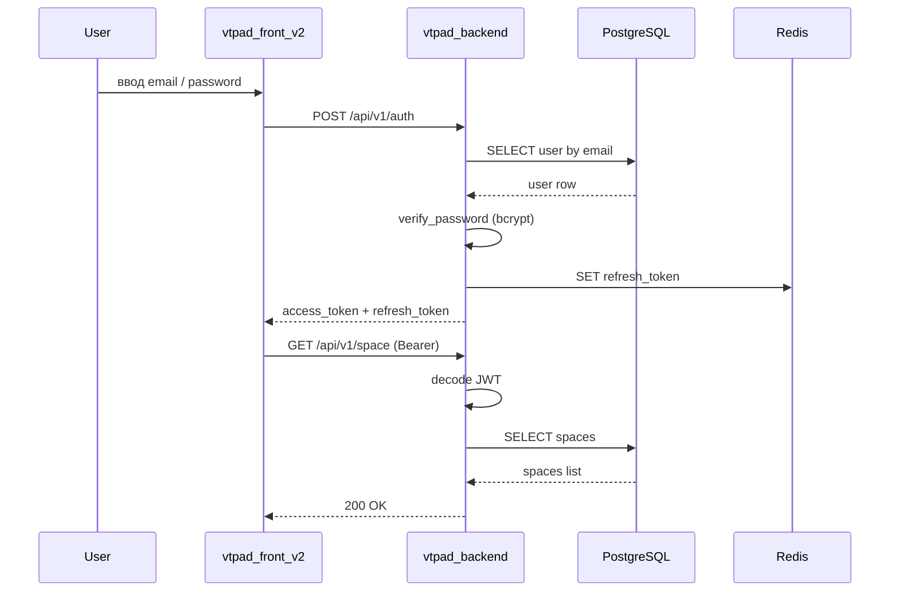

# Аутентификация и авторизация

## Что описывает

Поток входа пользователя в систему, обновления токенов и проверки прав доступа.

## Preconditions

- Пользователь зарегистрирован.
- Backend доступен (`vtpad_backend`), Redis запущен.

## Поведение системы

### Основной happy-path

1. Пользователь вводит email и password на странице `/auth`.
2. Frontend вызывает `POST /api/v1/auth` с `AuthUserDto`.
3. Backend:
   - Ищет пользователя по email в PostgreSQL.
   - Проверяет пароль через bcrypt (`passlib`).
   - Генерирует JWT access token (длительный TTL ~30000 мин).
   - Генерирует refresh token, сохраняет его в Redis.
4. Frontend получает оба токена и сохраняет (access — в памяти/Axios defaults, refresh — в `localStorage`).
5. Все последующие запросы содержат `Authorization: Bearer <access>`.
6. При 401 frontend вызывает `POST /api/v1/auth/refresh` с refresh token.
7. Backend проверяет refresh token в Redis и выдаёт новую пару.

### Sequence diagram

## Edge-cases

| Сценарий | Где проявляется | Поведение системы | Действие клиента |
|---|---|---|---|
| Неверный пароль | backend `POST /auth` | `401 Unauthorized` | Показать ошибку «Неверные учетные данные» |
| Пользователь не найден | backend `POST /auth` | `401 Unauthorized` | Показать ошибку «Неверные учетные данные» |
| Invalid refresh token | backend `POST /auth/refresh` | `401 Unauthorized` | Редирект на страницу входа |
| Redis недоступен | backend `POST /auth/refresh` | `500` или fallback | Пользователь вылетает из сессии |

## Ограничения

- Access token имеет очень большой TTL (~30000 мин); фактически это long-lived token.
- Нет rate limiting на endpoint'ах auth.
- CORS `allow_origins=['*']` позволяет запросы с любого origin.

## Источники в коде

- `vtpad_backend/app/src/auth/router.py`
- `vtpad_backend/app/src/auth/service.py`
- `vtpad_backend/app/src/common/crypto.py`
- `vtpad_backend/app/src/redis/service.py`
- `vtpad_front_v2/src/components/auth/authComponent.vue`
