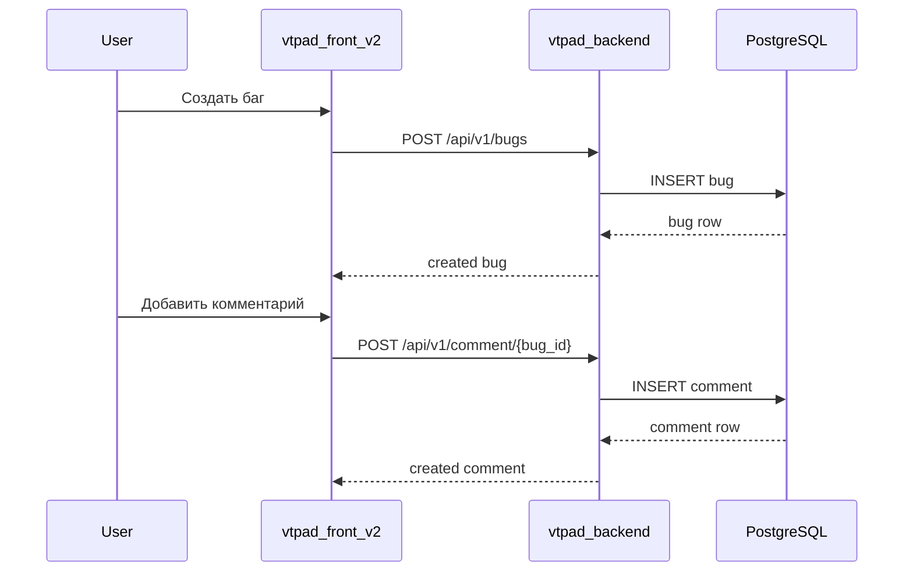

# Жизненный цикл бага

## Что описывает

Полный поток создания, обновления и комментирования бага внутри space.

## Preconditions

- Пользователь аутентифицирован.
- Space существует, пользователь имеет к нему доступ.

## Поведение системы

### Создание бага

1. Пользователь нажимает «Создать баг» в UI.
2. Frontend вызывает `POST /api/v1/bugs` с `CreateBugDto`.
3. Backend валидирует DTO, создаёт запись в PostgreSQL.
4. Возвращает созданный баг.

### Обновление бага

1. Frontend вызывает `PUT /api/v1/bugs/{bug_id}` с `UpdateBugDto`.
2. Backend обновляет поля (status, priority, assignee и т.д.).
3. При изменении assignee может генерироваться notification.

### Фильтрация и список

1. Frontend вызывает `GET /api/v1/bugs?space_id=...&status=...`.
2. Backend выполняет raw SQL query с JOIN'ами и фильтрами.
3. Возвращает список с пагинацией.

### Комментарии

1. Frontend вызывает `POST /api/v1/comment/{bug_id}`.
2. Backend создаёт comment, привязанный к bug.
3. `GET /api/v1/comment/{bug_id}` — список комментариев.

### Sequence diagram

## Edge-cases

| Сценарий | Где проявляется | Поведение системы |
|---|---|---|
| Баг не найден | `GET /bugs/detail/{bug_id}` | `404` |
| Нет прав на space | любой space-level endpoint | `403 Forbidden` |
| Raw SQL ломается при смене схемы | `GET /bugs` (фильтры) | `500` из-за hardcoded column names |

## Ограничения

- Фильтрация bugs реализована через raw SQL; при изменении моделей нужно синхронизировать запросы.
- Нет встроенного аудита изменений бага (history).

## Источники в коде

- `vtpad_backend/app/src/bug/router.py`
- `vtpad_backend/app/src/bug/service.py`
- `vtpad_backend/app/src/comments/router.py`
- `vtpad_backend/app/src/comments/service.py`
- `vtpad_front_v2/src/components/bugs/bugsListComponent.vue`
- `vtpad_front_v2/src/components/bugs/modal/bugsModalComponent.vue`
