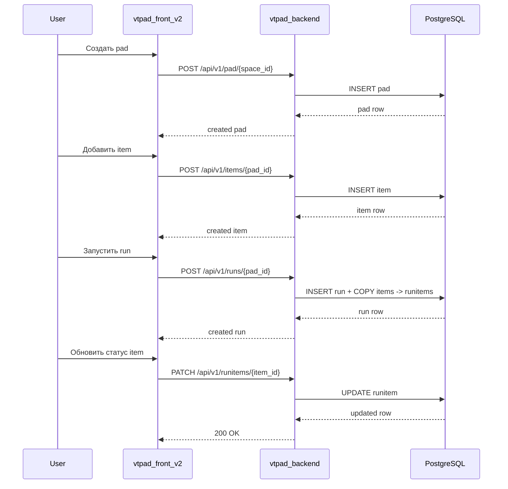

# Жизненный цикл Pad / Run

## Что описывает

Поток создания тест-плана (Pad), его наполнения items, запуска прогона (Run) и фиксации результатов.

## Preconditions

- Пользователь аутентифицирован и имеет доступ к space.
- Space существует.

## Поведение системы

### Создание Pad

1. Пользователь создаёт pad в UI.
2. Frontend: `POST /api/v1/pad/{space_id}` с `CreatePadDto`.
3. Backend создаёт pad в PostgreSQL.

### Наполнение Pad items

1. Frontend: `POST /api/v1/items/{pad_id}` с `CreateItemDto`.
2. Backend создаёт item (может ссылаться на testcase или checklist).
3. Frontend: `PUT /api/v1/testcases-paditem/...` для привязки testcase (deprecated).

### Создание Run

1. Пользователь запускает run из pad.
2. Frontend: `POST /api/v1/runs/{pad_id}` с `CreateRunDto`.
3. Backend:
   - Создаёт run.
   - Копирует items из pad в runitems.
4. Возвращает run с runitems.

### Прохождение Run

1. Пользователь обновляет статус runitem.
2. Frontend: `PATCH /api/v1/runitems/{item_id}` с `UpdateRunItemDto`.
3. Backend обновляет статус (pass / fail / skip и т.д.).

### Sequence diagram

## Edge-cases

| Сценарий | Где проявляется | Поведение системы |
|---|---|---|
| Pad не найден | `POST /runs/{pad_id}` | `404` |
| Run не найден | `PATCH /runitems/{item_id}` | `404` |
| Нет прав на space | space-level endpoints | `403` |

## Ограничения

- Нет встроенного механизма версионирования pad (snapshot перед изменением).
- Run копирует items на момент создания; изменения pad после этого не отражаются на run.

## Источники в коде

- `vtpad_backend/app/src/pad/router.py`
- `vtpad_backend/app/src/pad/service.py`
- `vtpad_backend/app/src/items/router.py`
- `vtpad_backend/app/src/run/router.py`
- `vtpad_backend/app/src/run/service.py`
- `vtpad_backend/app/src/runitems/router.py`
- `vtpad_front_v2/src/components/pads/padsListComponent.vue`
- `vtpad_front_v2/src/components/runs/detail/runsDetailComponent.vue`
